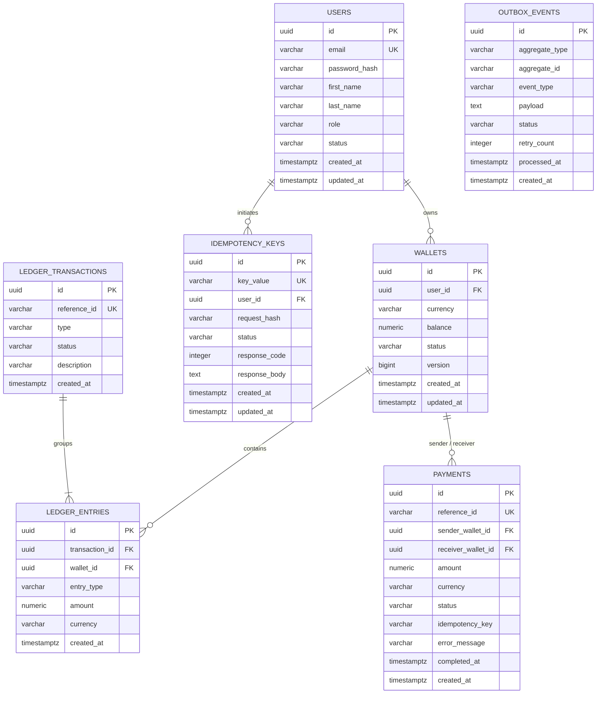

# 🗄️ Database Schema & Data Models

FintechLedger uses **PostgreSQL 16** with strict relational integrity, UUID primary keys, and decimal precision (`NUMERIC(19,4)`) for currency fields to prevent floating-point rounding inaccuracies.

---

## 1. Entity Relationship (ER) Diagram

---

## 2. Table Specifications & Indexes

### 2.1 `users` Table
Stores authenticated actors and authorization roles.
- **Constraints**: `email UNIQUE`, `role IN ('ROLE_USER', 'ROLE_ADMIN', 'ROLE_AUDITOR')`.

### 2.2 `wallets` Table
Maintains multi-currency customer account balances.
- **Constraints**: `UNIQUE(user_id, currency)` prevents duplicate wallets for the same currency.
- **Locking & Concurrency**:
  - `version BIGINT NOT NULL` for Hibernate Optimistic Locking.
  - `SELECT ... FOR UPDATE` row-level locks for transaction mutations.

### 2.3 `ledger_transactions` Table
Represents an atomic financial event (e.g. `TRANSFER`, `DEPOSIT`, `WITHDRAWAL`).
- **Constraints**: `reference_id UNIQUE` for financial audit tracking.

### 2.4 `ledger_entries` Table
Immutable ledger records of debits and credits.
- **Invariant**: Every transaction references at least 2 entries whose sum equals zero:
  $$\sum_{\text{transaction}} (\text{DEBIT} - \text{CREDIT}) = 0$$
- **Index**: `idx_ledger_entries_wallet_id`, `idx_ledger_entries_tx_id`.

### 2.5 `payments` Table
High-level payment lifecycle state machine (`PENDING` $\to$ `COMPLETED` | `FAILED` $\to$ `REVERSED`).
- **Index**: `idx_payments_ref_id`, `idx_payments_sender`, `idx_payments_receiver`.

### 2.6 `idempotency_keys` Table
Tracks unique client mutation tokens, request hashes, and cached responses.
- **Constraints**: `key_value UNIQUE`.
- **Index**: `idx_idempotency_key_lookup` on `(key_value, user_id)`.

### 2.7 `outbox_events` Table
Stores transactional event payloads before dispatch to Kafka.
- **Index**: `idx_outbox_events_status_created` on `(status, created_at)` for high-speed batch polling.

---

## 3. Flyway Migration Version History

| Migration Version | Description |
| :--- | :--- |
| **V1** | Initial users table schema with role and status enums |
| **V2** | Wallets table schema with optimistic locking and currency uniqueness |
| **V3** | Ledger transactions audit table |
| **V4** | Double-entry ledger entries table |
| **V5** | Payments tracking table with reference IDs |
| **V6** | Idempotency keys table with request hashes and response cache |
| **V7** | Transactional outbox events table for reliable Kafka messaging |
